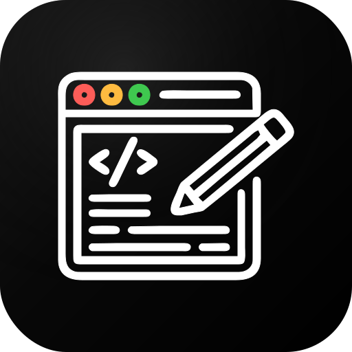
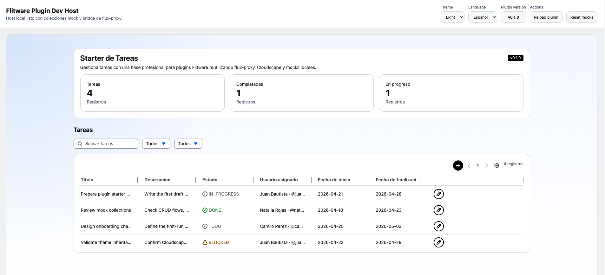
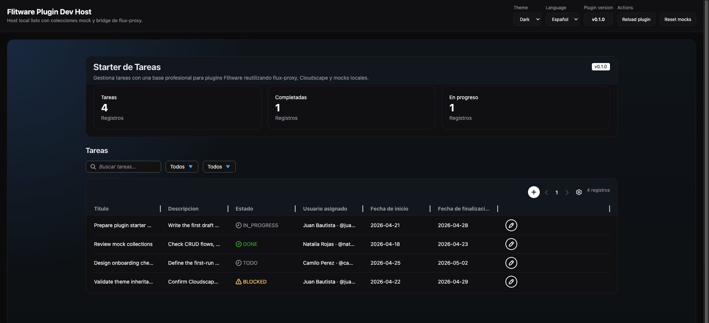
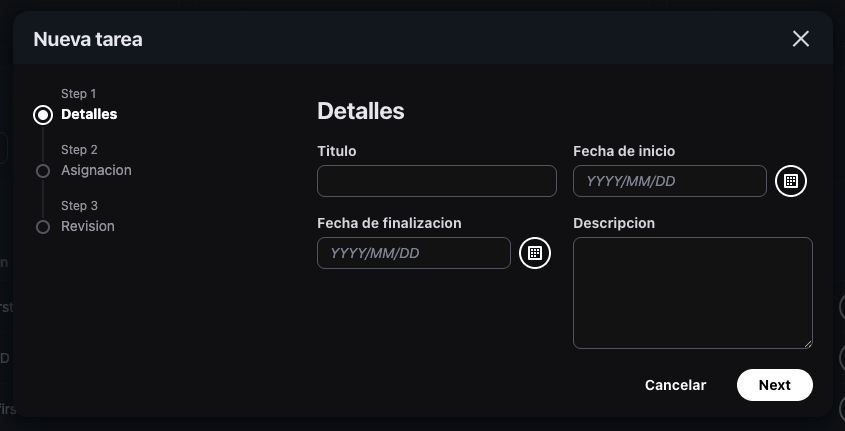
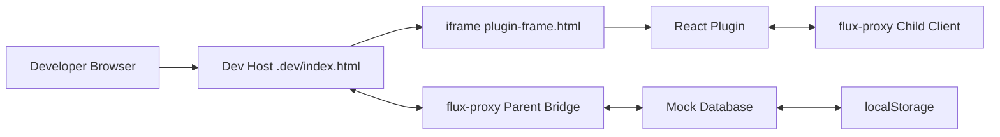
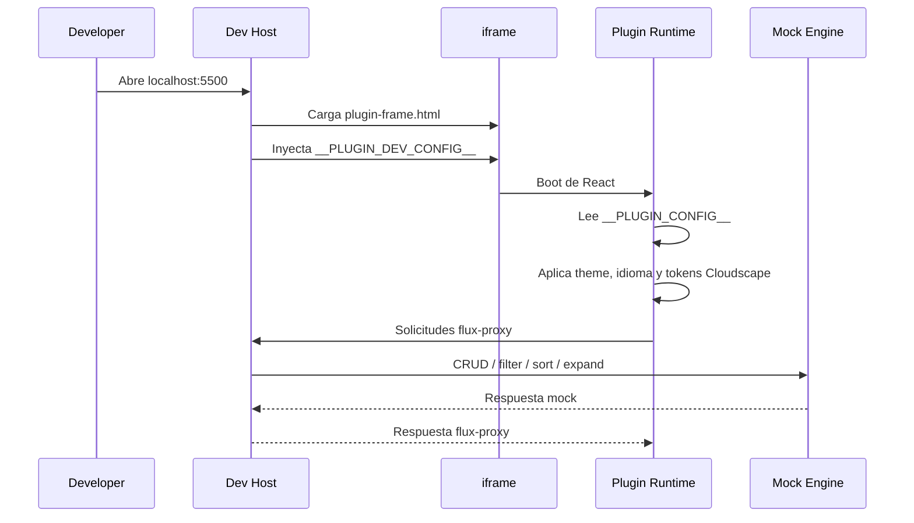
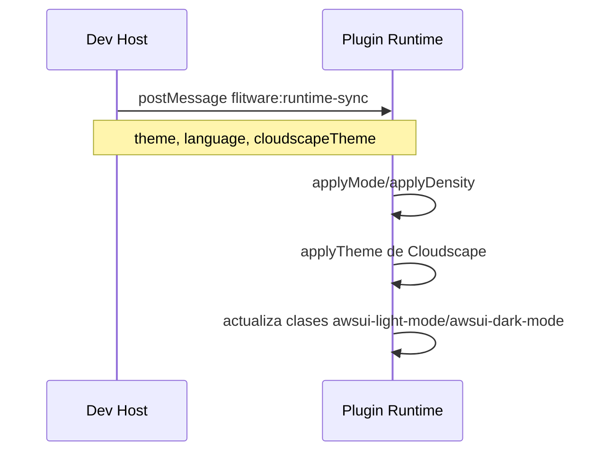
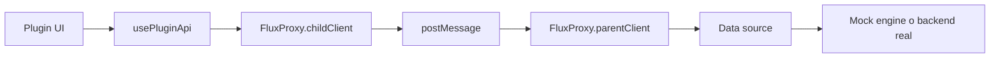

# Flitware Dummy Plugin Starter
 
 --

 
 
 


Starter publico de Flitware para que terceros construyan plugins externos con una base real de:

- `Cloudscape`
- `flux-proxy`
- herencia de tema e idioma desde la aplicacion principal
- mocks locales con `CRUD`, `filter`, `sort`, `expand` y paginacion
- build productivo en un solo archivo `dist/index.html`
- host local de desarrollo con `iframe`

El dominio de ejemplo de este starter es un sistema de gestion de tareas. La idea no es que publiques este plugin tal cual, sino que lo uses como punto de partida para tu propio plugin.

## Guia para agentes de codigo

Este starter incluye una guia dedicada para agentes en:

- `AGENTS.md`

Ese archivo resume:

- arquitectura
- runtime
- `flux-proxy`
- mocks
- reglas para editar sin romper el starter
- flujo recomendado de validacion

## Objetivos del starter

- Permitir desarrollo local sin depender de la app principal real.
- Simular colecciones estilo flitware para probar relaciones y `expand`.
- Mantener una arquitectura cercana a la que se ejecuta dentro de Flitware.
- Entregar un bundle productivo simple de publicar.
- Servir como referencia para plugins que usen colecciones internas o backends propios.

## Stack

- `React 19`
- `TypeScript`
- `Cloudscape`
- `flux-proxy`
- `esbuild`
- `live-server`
- `Node test runner`

## Scripts

```bash
npm run dev
npm run build:dev
npm run build
npm test
npm run test:coverage
```

Que hace cada script:

- `npm run dev`: recompila en watch mode y levanta el host local en `http://localhost:5500`.
- `npm run build:dev`: genera el entorno de desarrollo dentro de `.dev`.
- `npm run build`: genera el artefacto productivo unico en `dist/index.html`.
- `npm test`: ejecuta la suite unitaria.
- `npm run test:coverage`: ejecuta la suite con cobertura.

## Inicio rapido

### 1. Instalar dependencias

```bash
npm install
```

### 2. Ejecutar el entorno local

```bash
npm run dev
```

Abre:

```txt
http://localhost:5500
```

### 3. Construir el plugin productivo

```bash
npm run build
```

Resultado:

```txt
dist/index.html
```

## Como funciona el entorno de desarrollo

El modo desarrollo crea dos capas:

- un `host local`
- el `plugin real` renderizado dentro de un `iframe`

El host emula lo esencial de Flitware:

- `window.__PLUGIN_CONFIG__`
- sincronizacion de `theme`
- sincronizacion de `language`
- `pluginVersion`
- puente `flux-proxy`
- mocks persistidos en `localStorage`

### Arquitectura general



### Flujo de arranque



### Flujo de sync de runtime



## Estructura del proyecto

```txt
app/
  api/
    plugin-client.ts
  components/
    plugin-date-field.tsx
    relation-autosuggest.tsx
    resource-table.tsx
  runtime/
    plugin-runtime.tsx
  screens/
    task-dashboard.tsx
  utils/
    date.ts
    filter.ts
    use-debounced-value.ts
dev/
  flitware-theme.ts
  host.ts
  mock-engine.ts
  task-dev-data.ts
scripts/
  run-tests.mjs
tests/
  *.test.ts
build.js
dev-build.js
watch.js
plugin.config.json
```

Responsabilidades principales:

- `app/api/plugin-client.ts`: cliente del plugin para hablar con el host usando `flux-proxy`.
- `app/runtime/plugin-runtime.tsx`: lee configuracion inicial, escucha sync por `postMessage` y aplica el tema.
- `app/screens/task-dashboard.tsx`: ejemplo real de UI productiva usando tabla, filtros, wizard y relaciones.
- `dev/host.ts`: host local que emula la app principal.
- `dev/mock-engine.ts`: motor mock con soporte de consultas y relaciones.
- `dev/task-dev-data.ts`: dataset y adaptadores mock del dominio de tareas.
- `build.js`: build de produccion en un solo archivo.
- `dev-build.js`: build del entorno local.

## Dominio del ejemplo

Colecciones mock incluidas:

### `task_status`

- `id`
- `created`
- `updated`
- `name`
- `description`

### `users`

- `id`
- `created`
- `updated`
- `name`
- `username`
- `email`
- `phone`

### `tasks`

- `id`
- `created`
- `updated`
- `title`
- `description`
- `start_date`
- `end_date`
- `status` -> relacion con `task_status`
- `assignee` -> relacion con `users`

## Mocks y base de datos local

El mock engine vive en `dev/mock-engine.ts` y soporta:

- `getList`
- `getById`
- `create`
- `update`
- `delete`
- `reset`
- `filter`
- `sort`
- `expand`
- paginacion
- persistencia en `localStorage`

### Capacidades de consultas mock

- operadores `=`, `!=`, `~`
- combinadores `&&`, `||`
- parentesis
- filtros sobre relaciones
- `expand` anidado como `group.members`
- `sort` multiple como `-created,title`

Ejemplos:

```txt
status = "task_status_done"
assignee.username ~ "juan" || assignee.username ~ "JUAN"
(status != "task_status_done") && (assignee.email ~ "flitware")
expand=status,assignee
sort=-created,title
```

### Persistencia local

Los mocks se persisten en `localStorage` usando una `storageKey` del proyecto. Esto permite:

- recargar la pagina sin perder cambios mock
- probar `create`, `edit` y `delete`
- resetear el estado con el boton `Reset mocks` del host

## Como funciona `flux-proxy`

El plugin no habla directamente con flitware ni con la app host. Habla con `flux-proxy`, y el host responde.

### Contrato conceptual



### En el plugin

`app/api/plugin-client.ts` expone helpers como:

- `list`
- `getOne`
- `create`
- `update`

Todos envian mensajes a traves de `FluxProxy.childClient`.

### En el host

`dev/host.ts` recibe los mensajes con `FluxProxy.parentClient` y los resuelve usando:

- `createTaskMockEnvironment()`
- `resolvePluginProxyMessage(...)`

### Acciones soportadas por este starter

#### `getData`

- lista paginada
- lectura por `id`

#### `postData`

- `create`
- `update`
- `delete`

## Tema, idioma y Cloudscape

Este starter ya viene listo para heredar configuracion visual desde Flitware.

### Datos recibidos por el plugin

```ts
window.__PLUGIN_CONFIG__ = {
  theme: "light" | "dark",
  language: "es" | "en",
  cloudscapeTheme: Theme,
  fluxProxy: {
    targetOrigin: string
  },
  plugin: {
    installedPluginId: string,
    pluginId: string,
    version: string
  }
}
```

### Que hace el runtime

`app/runtime/plugin-runtime.tsx`:

- lee `window.__PLUGIN_CONFIG__`
- aplica `applyMode`
- aplica `applyDensity`
- aplica el tema de Cloudscape con `applyTheme`
- sincroniza clases `awsui-light-mode` y `awsui-dark-mode`
- escucha `flitware:runtime-sync`

Esto permite que el plugin se vea coherente tanto en:

- desarrollo local
- iframe dentro de Flitware

## UI de ejemplo incluida

El dashboard de ejemplo ya demuestra un plugin de nivel productivo:

- tarjetas KPI
- tabla paginada
- acciones por icono
- filtros por estado y usuario
- busqueda
- wizard para crear y editar
- `DatePicker`
- autosuggest remoto para relaciones
- review final del formulario

La meta es que puedas tomar esta pantalla, cambiar el dominio y conservar la infraestructura.

## Build de produccion

`build.js` genera un solo archivo:

```txt
dist/index.html
```

Ese archivo ya contiene:

- HTML
- CSS inline
- JavaScript inline

Ademas:

- preserva comentarios legales requeridos por Cloudscape
- embebe assets necesarios
- evita multiples archivos para despliegue

## Build de desarrollo

`dev-build.js` genera:

- `.dev/index.html`
- `.dev/plugin-frame.html`
- `.dev/assets/plugin.js`
- `.dev/assets/plugin.css`
- `.dev/assets/host.js`

El `watch.js` recompila y solo arranca el servidor la primera vez.

## Pruebas

La suite cubre:

- utilidades de fechas
- utilidades de filtros
- motor mock
- adaptador de datos mock
- contrato de mensajes del bridge

Archivos relevantes:

- `tests/date.test.ts`
- `tests/filter.test.ts`
- `tests/mock-engine.test.ts`
- `tests/task-dev-data.test.ts`

## Como extender este starter

### Si vas a usar colecciones de Flitware

1. Cambia el dataset mock en `dev/task-dev-data.ts`.
2. Cambia la UI principal en `app/screens/task-dashboard.tsx`.
3. Reutiliza `usePluginApi()` para hablar con el host real.
4. Mantén relaciones, `expand`, filtros y paginacion compatibles con tu backend.

### Si vas a usar tu propio backend

Tienes dos opciones:

- dejar `flux-proxy` para que el host siga siendo intermediario
- reemplazar `usePluginApi()` por tu propio cliente HTTP

Si eliges backend propio, intenta conservar:

- `PluginRuntimeProvider`
- integracion de tema
- estructura de `ResourceTable`
- host local para demos y QA

## Flujo recomendado para crear un plugin nuevo

1. Copia este starter a un directorio nuevo.
2. Renombra `plugin.config.json`.
3. Sustituye las colecciones mock por las de tu dominio.
4. Reemplaza `task-dashboard.tsx` por tu pantalla principal.
5. Ajusta tests para tu dominio.
6. Valida `npm run dev`, `npm run build` y `npm test`.

## Publicacion dentro de Flitware

En Flitware el host real:

- carga tu `index.html`
- inyecta `window.__PLUGIN_CONFIG__`
- expone el bridge de `flux-proxy`
- sincroniza `theme`, `language` y `pluginVersion`

Por eso es importante que este starter conserve:

- contrato de runtime
- contrato de `flux-proxy`
- compatibilidad con Cloudscape

## Notas importantes

- `app/api/plugin-client.ts` fuerza `requestKey: null` para evitar la auto-cancelacion de flitware durante filtros y busquedas concurrentes.
- `.plugin-deps` se usa como cache local de dependencias de Cloudscape para builds estables del starter.
- El host local esta pensado para desarrollo, no para produccion.

## Checklist antes de publicar un plugin derivado

- `npm run dev` funciona
- `npm run build` genera `dist/index.html`
- `npm test` pasa
- el plugin funciona en light y dark mode
- las traducciones basicas estan resueltas
- los mocks representan tu dominio real
- la comunicacion con el host esta validada

## Licencia

MIT
